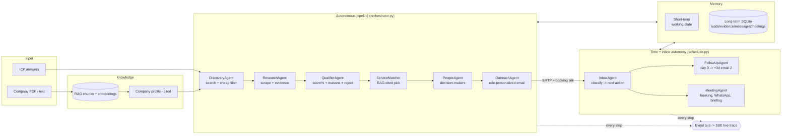

# AutoSDR — Autonomous AI Sales Agent

**AgentHack 2026 submission.** An end-to-end autonomous sales team: feed it a company
document, tell it who to hunt, and it discovers real leads, researches them with
evidence, scores and explains its qualification, picks the right service, finds the
decision-makers, writes role-personalized outreach, reads and classifies replies,
follows up on schedule, books meetings, and briefs the admin on WhatsApp before
each call — remembering everything across the lifecycle.

**Fully company-agnostic.** Nothing is hardcoded to the sample dossier: every agent
grounds on whatever profile + RAG the uploaded document produces. Verified by
ingesting a structurally different company (a Punjab solar installer) — services,
case studies, limitations and a market-appropriate ICP all regrounded correctly.

```
Company PDF → RAG → ICP → Discovery → Cheap Filter → Deep Research → Qualification
→ Service Match → Decision Makers → Personalized Email → Reply Classification
→ Follow-up → Meeting Booking → Admin WhatsApp + Briefing → Memory → Pipeline
```

## Architecture



## The 11 agents

| Agent | Job | Grounding |
|---|---|---|
| **KnowledgeAgent** | Company PDF/text → RAG knowledge base → structured profile (services, cases, pricing, limitations) | Every service/case cites its source chunks; prefers current records over outdated ones (the dossier's §27 conflict trap) |
| **ICPAgent** | Targeting answers → structured ICP + search strategy + disqualifiers | Grounded in what the company actually sells |
| **DiscoveryAgent** | Web search → dedupe → **cheap filter** (fast model, snippets only) | Staged exactly as required: no deep research until cheap filtering passes |
| **ResearchAgent** | Site scrape + subpages + news/funding searches → evidence dossier | Every claim stored with URL + quote; no evidence ⇒ no claim |
| **QualifierAgent** | Confidence % + per-factor breakdown + risks; **can and does reject** | Scores capped by evidence quality |
| **ServiceMatcher** | Picks ONE service from the catalog per prospect | Cites RAG chunks; never recommends off-catalog |
| **PeopleAgent** | Decision-makers relevant to the matched service | Emails labeled `scraped` / `verified` / `guessed` — never presented as more certain than they are |
| **OutreachAgent** | Role-personalized email (CTO ≠ CEO ≠ Head of Support) + fresh booking link per email | Composes ONLY from stored evidence |
| **InboxAgent** | Classifies replies (positive / meeting / question / pricing objection / technical objection / not interested / not now / referral) → next action | Objection answers grounded in RAG; unknown ⇒ "confirm on a call", never invented |
| **FollowUpAgent** | Day 0 → wait 3 days → Email #2 with one new angle | Reads long-term memory of Email #1; auto-cancelled if a reply arrives |
| **MeetingAgent** | Confirmation email with fixed time + link, admin WhatsApp alert, 30-min pre-meeting briefing (problem, service, objections, talking points) | Briefing composed from the lead's full memory |

Orchestration is a hand-rolled state machine (`orchestrator.py`) + APScheduler for
time-based autonomy (`scheduler.py`). Every plan, tool call, decision, retry and
send is emitted to an event bus, persisted, and streamed to the dashboard's **live
agent trace** — nothing the system does is invisible.

## Memory (short-term + long-term)

- **Short-term** (`memory.py`): current task, active agent, per-lead scratch state
  (scraped contacts, working notes). Visible live in the Memory tab.
- **Long-term** (SQLite): leads, contacts, evidence, full message history, meetings,
  follow-ups, memory notes. `memory.recall(lead)` injects the relationship history
  into follow-ups, reply handling, and meeting briefings — the same lead is never
  treated as a stranger twice.

## Product features beyond the brief

- **Guided onboarding** — a 3-step wizard (company doc → ICP → launch) that takes a
  first-time user from zero to an autonomous run in under two minutes.
- **Human-in-the-loop approval mode** — one toggle queues all outreach as drafts for
  one-click *Approve & send* review. This mirrors NexaFlow's own governance doctrine
  (reviewed queues, approval gates for impactful actions) — the system practices what
  the company it sells for preaches. Fully autonomous when off.
- **Analytics strip** — funnel counts, emails (live vs simulated), replies, meetings,
  average qualified score, LLM spend and **cost per qualified lead**, live.
- **Live agent trace with filters** — every plan, tool call, decision, retry and send
  streams into a filterable feed (Decisions / Comms / Errors). Nothing is a black box.
- **Chat-style conversation view** — email and WhatsApp threads render as bubbles with
  live/sim/draft badges and intended-recipient labels; prospect replies can be
  simulated in-app for offline demos.
- **Search & score filters** on the pipeline board; score rings; stage-phase color
  coding; toasts for key autonomous events (live sends, bookings, queued drafts).
- **Themes** — light/dark mode plus four accent palettes (cyan, violet, emerald,
  amber), persisted per user, applied before first paint.
- **One-click lead reports** — `/report/{lead}` renders a printable dossier
  (score breakdown, service match, contacts, evidence) for sharing outside the app.
- **Deployed & deployable** — live public URL via Cloudflare tunnel
  (`scripts/tunnel.ps1`, also rewires email booking links to the public host),
  plus a `Dockerfile` and one-click Render blueprint (`render.yaml`). See DEPLOY.md.
- **Responsive** — usable down to phone widths; prospects open booking links on mobile.

## Honesty by design

- **Live emails only go to allowlisted inboxes we own** (`EMAIL_ALLOWLIST`).
  Anything else auto-routes to the simulated channel, clearly badged SIM in the UI.
  Researching real companies is fine; cold-emailing real strangers from a hackathon
  demo is spam, so we don't do it. (The brief explicitly allows email simulation.)
- Guessed email patterns are labeled `guessed`, never passed off as verified.
- The qualifier is rewarded for rejecting weak leads (goal: best leads, not most).
- Every factual claim in outreach traces to stored evidence with URL + quote.

## Demo clock

`SECONDS_PER_DAY` in `.env` scales all waits. At `60`, one "day" = one minute, so
the required *Day 0 → 3-day wait → follow-up* loop and the *30-minutes-before*
meeting reminder actually fire on camera. Set `86400` for real time.

## Run it

```bash
python -m venv .venv
.venv/Scripts/pip install -r requirements.txt   # Windows
cp .env.example .env                             # fill in keys
.venv/Scripts/python -m uvicorn app.main:app --port 8000
# open http://localhost:8000 → Setup tab → upload company PDF → build ICP → Run pipeline
```

Keys needed: `OPENAI_API_KEY` (chat + embeddings), `SERPER_API_KEY` (search, free tier).
Optional: `HUNTER_API_KEY` (email finding), Gmail app password (live email), Green
API / Twilio / CallMeBot (live WhatsApp).

## What's real vs simulated

| Component | Real | Simulated |
|---|---|---|
| Lead discovery & research | ✅ live Google (Serper) + live site scraping of real companies | — |
| RAG over company PDF | ✅ OpenAI embeddings + cited retrieval (TF-IDF fallback) | — |
| Qualification / matching / composing | ✅ live LLM calls, evidence-injected | — |
| Email | ✅ real SMTP/IMAP (Gmail) **to allowlisted demo inboxes** | non-allowlisted addresses auto-route to in-app inbox, badged SIM |
| WhatsApp | ✅ real via Green API / Twilio / CallMeBot when configured | in-app panel, badged SIM |
| Meeting links | ✅ real Jitsi rooms + in-app booking page | — |
| Follow-up / reminder timing | ✅ real scheduler | time-scaled by demo clock |
